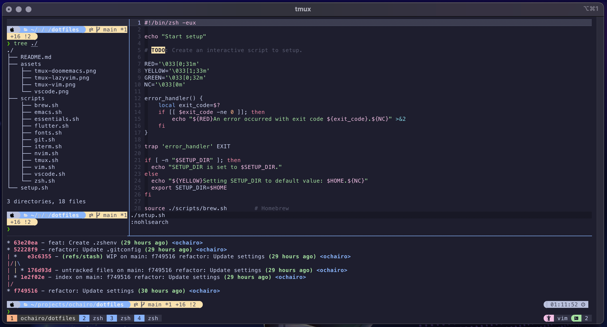
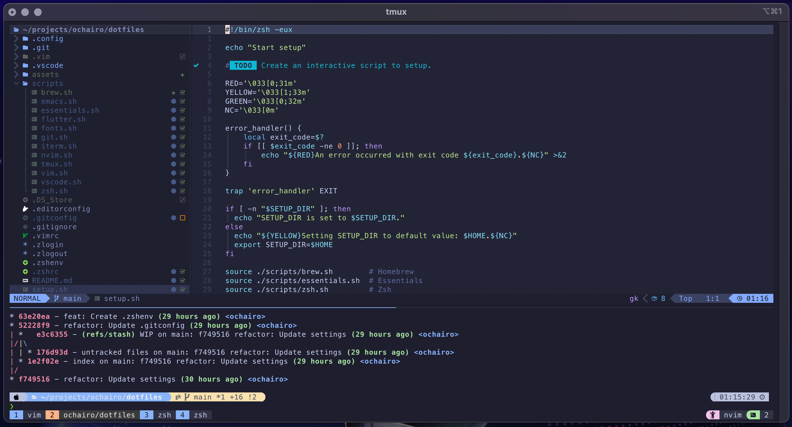
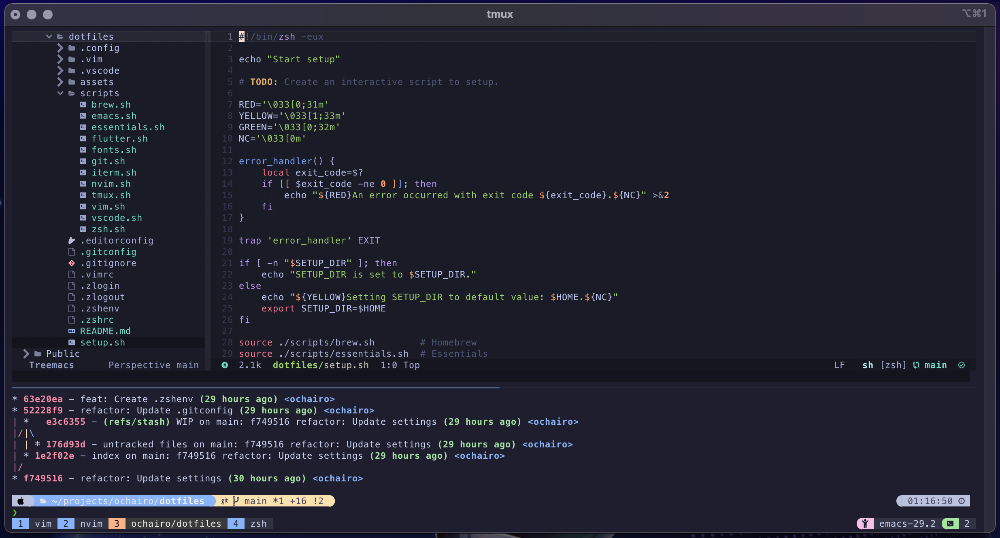
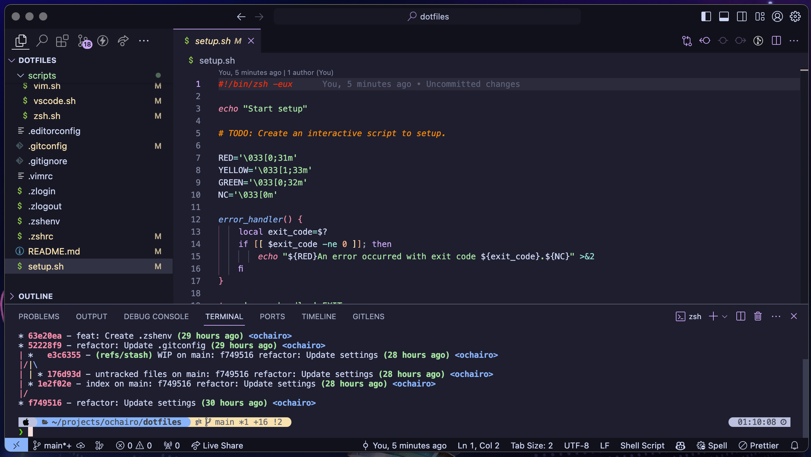

# dotfiles

Dotfiles for macOS

## Getting Started

- Clone the repository.

- Declare the variable "REPO_DIR" with the path with which you cloned the repository and run 'start-setup.sh'. Note that if "REPO_DIR" is not declared, "REPO_DIR" will be "$HOME" by default.

  ```sh
  export REPO_DIR=$HOME && sh $REPO_DIR/dotfiles/start-setup.sh
  ```

## Common Configurations

1. Open or re-open your terminal.
1. Change the font to `MesloLGS NF`.
1. Import the colorscheme from `~.config/iterm2/catppuccin/colors`.
1. After complete all above, Follow the instructions displayed in the terminal to complete the setup.

### Vim



### Neovim



### Emacs



### VScode



## TODO: Detailed Configurations

- ...
