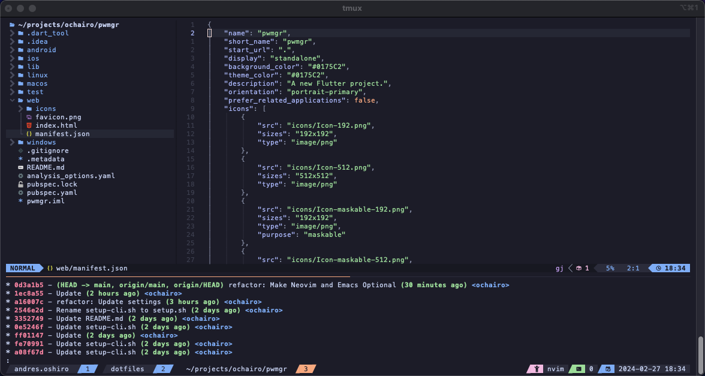

# dotfiles

Dotfiles for MacOS

## Getting Started
- Clone the repository and run the "bootstrap" shell script

  ```sh
  sh ./bootstrap.sh
  ```

## Configurations

### iTerm2

1. Open or re-open iTerm2.
1. Open preferences
   1. Change the font to `MesloLGS NF`.
   1. Select colorscheme from `~/.config/iterm2/catppuccin/colors`.

### Tmux

1. Start tmux
1. Install plugins
   1. Press `Control` and `s`. Then `Shift` and `i`.
  
### Nvim

1. Enable Copilot, Prettier and more plugins with `:LazyExtras`
   1. Read the [Documet](https://www.lazyvim.org/extras) page for more information.

## Editor usage

You can use vim, nvim, emacs and if necessary combine it with tmux or just use vscode.

- tmux + nvim
  
