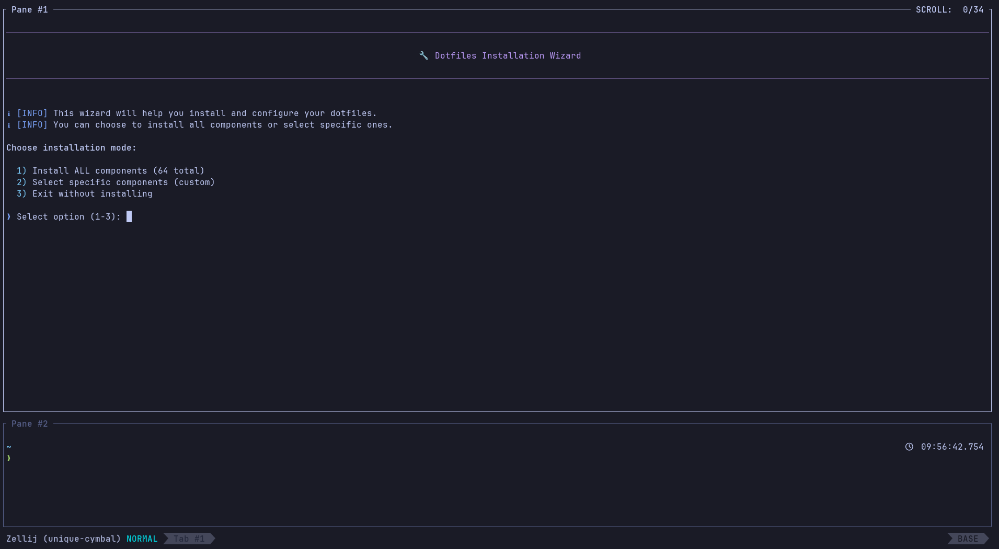
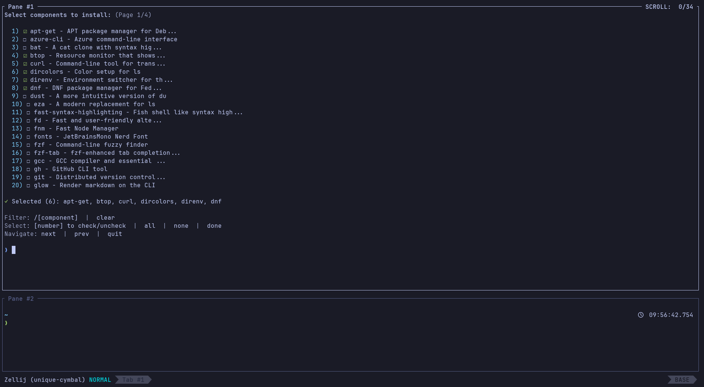

<div align="center">

# 🔧 Dotfiles CLI

<p>
  <a href="https://github.com/ochairo/dotfiles/actions/workflows/ci.yml" style="text-decoration: none;"></a>
  <a href="#platform-support" style="text-decoration: none;"></a>
  <a href="https://github.com/ochairo/dotfiles/tree/main/src/components" style="text-decoration: none;"></a>
</p>

<h3>Personal dotfiles CLI for Unix-like Systems</h3>

<p><em>Declarative, modular development environment with automatic dependency management</em></p>

<br>

</div>

## Overview

- **Interactive Wizard**: UI for component selection with multiselect and descriptions
- **Configuration as Code**: YAML-defined components with automatic dependency resolution
- **Modular Architecture**: 60+ components for selective installation - install all or pick what you need
- **Smart Installation**: Parallel execution with dependency-aware batching for faster setup
- **Cross-Platform**: Native package manager detection (Homebrew, apt, dnf) with platform-specific configs
- **Shell Enhancement**: Zsh with Oh My Zsh, Starship prompt, syntax highlighting, and autosuggestions
- **Development Tools**: Neovim with LSP, language version managers (pyenv, fnm, rustup), and modern CLI tools
- **Safe & Traceable**: Transactional operations with rollback, backup, and ledger tracking

## Platform Support

- **macOS** 10.15+ (Catalina or later)
- **Linux**: Ubuntu, Debian, Fedora, RHEL

## Quick Start

### 1. Clone the Repository

```bash
git clone https://github.com/ochairo/dotfiles.git ~/.dotfiles
cd ~/.dotfiles
```

### 2. Add to PATH

**For Zsh (macOS default):**

```zsh
echo 'export PATH="$HOME/.dotfiles/src/cli/bin:$PATH"' >> ~/.zshrc
source ~/.zshrc
```

**For Bash:**

```bash
echo 'export PATH="$HOME/.dotfiles/src/cli/bin:$PATH"' >> ~/.bashrc
source ~/.bashrc
```

### 3. Use the CLI

Now you can use the `dot` command from anywhere:

```bash
# Interactive setup wizard
dot init
```





---
